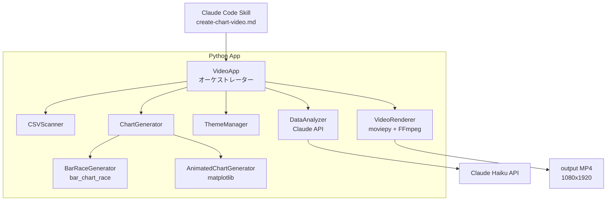
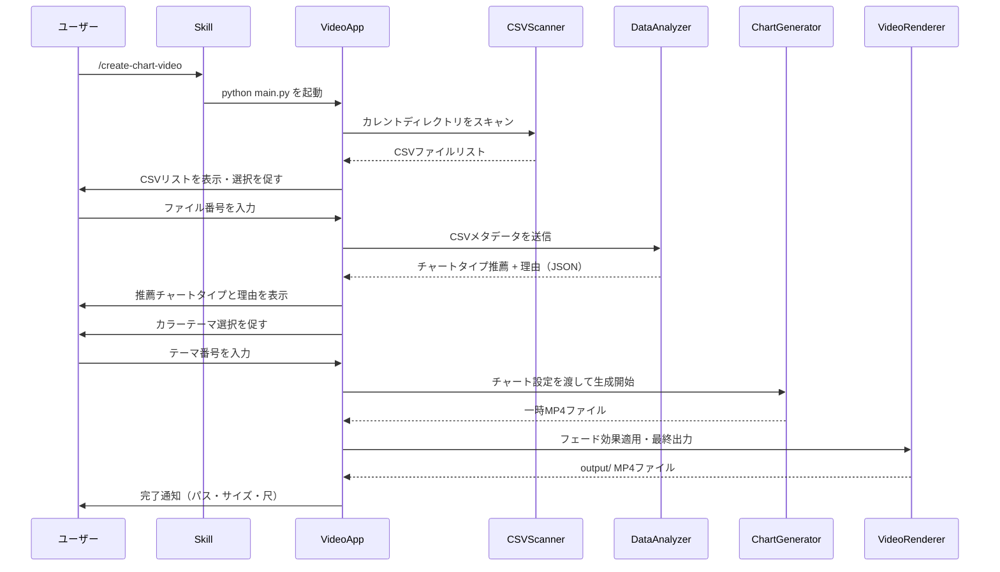
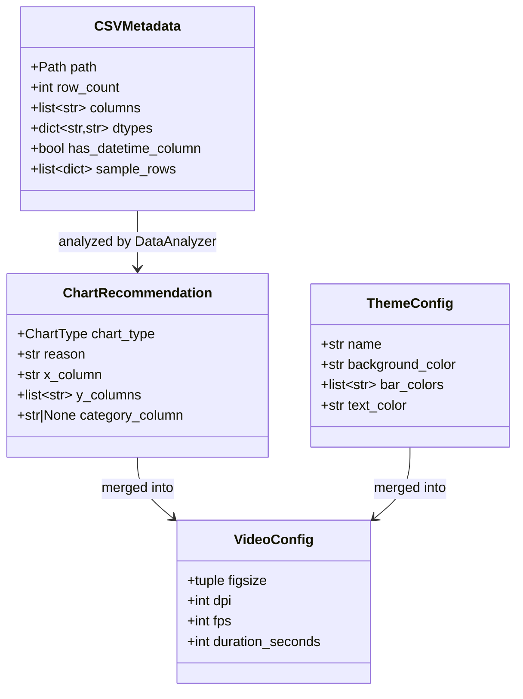

# 設計書: csv-chart-short-video

## 概要

本機能は、CSV ファイルからアニメーション付きチャート動画を自動生成する Python アプリケーションを提供する。Claude Code カスタムスキル（`/create-chart-video`）として実行でき、Claude AI がデータを分析してチャートタイプを自動推薦する。出力は TikTok・YouTube Shorts に最適化した縦型（1080×1920px / 9:16）MP4 形式。

**Purpose**: インタラクティブな対話フローにより、ユーザーは CSV を選択してカラーテーマを選ぶだけで高品質なショート動画を生成できる。
**Users**: ショート動画クリエイター、データを視覚化して発信したいユーザー。
**Impact**: 専門的な動画編集スキルなしに、データドリブンなショート動画を量産できる。

### ゴール
- `/create-chart-video` 1コマンドで動画生成を完結させる
- AI が CSV 構造を分析し、最適なチャートタイプを推薦する
- 縦型 9:16 フォーマット（1080×1920px）の高品質 MP4 を出力する

### 非ゴール
- 横型・正方形フォーマットの出力（将来拡張）
- リアルタイムデータ取得（CSV のみ対象）
- 音声・BGM の追加（将来拡張）
- Web UI の提供

---

## アーキテクチャ

### アーキテクチャパターン & バウンダリーマップ

**選択パターン**: パイプライン型（インタラクティブ CLI + 処理パイプライン）

- インタラクティブな CLI レイヤーがユーザー入力を収集し、各処理コンポーネントを逐次呼び出す
- 各コンポーネントは単一責任を持ち、独立してテスト可能
- Claude Code スキルは薄いオーケストレーター層として機能し、実ロジックは Python に委譲



### テクノロジースタック

| Layer | Choice / Version | Role | Notes |
|-------|------------------|------|-------|
| CLI / Skill | Claude Code Skill (.md) | `/create-chart-video` コマンドのエントリーポイント | Bash ツールで Python 呼び出し |
| インタラクティブ CLI | Python 標準 `input()` | ユーザーとの対話フロー | 外部ライブラリ不要 |
| データ処理 | pandas >= 2.0 | CSV 読み込み・型推論・集計 | |
| バーレースアニメーション | bar-chart-race >= 0.1.0 | バーレースチャート専用 | matplotlib バックエンド |
| 汎用アニメーション | matplotlib >= 3.7 | 棒グラフ・折れ線グラフアニメーション | FuncAnimation 使用 |
| 動画後処理 | moviepy >= 1.0.3 | フェードイン・アウト効果適用 | FFmpeg ラッパー |
| FFmpeg | imageio-ffmpeg >= 0.4.9 | MP4 エンコード | クロスプラットフォーム自動管理 |
| AI 分析 | anthropic >= 0.40 | データ分析・チャートタイプ推薦 | claude-haiku-4-5-20251001 使用 |
| ランタイム | Python >= 3.10 | | 型ヒント（match 文）サポート |

---

## システムフロー

### メインフロー



---

## 要件トレーサビリティ

| 要件 | サマリー | コンポーネント | インターフェース | フロー |
|------|---------|---------------|----------------|-------|
| 1.1 | CSV自動検出・リスト表示 | CSVScanner | `scan_csv_files()` | メインフロー Step 2 |
| 1.2 | CSV 1ファイル時自動選択 | CSVScanner | `scan_csv_files()` | メインフロー Step 3 |
| 1.3 | CSV未発見時エラー | CSVScanner | `CSVScanError` | エラーハンドリング |
| 1.4 | CSVロード・メタデータ表示 | CSVScanner | `load_csv()` | メインフロー Step 3 |
| 1.5 | UTF-8/Shift-JIS対応 | CSVScanner | `load_csv()` | — |
| 2.1–2.5 | AIによるデータ分析・推薦 | DataAnalyzer | `analyze()` | メインフロー Step 4 |
| 3.1–3.4 | カラーテーマ選択 | ThemeManager | `get_theme()` | メインフロー Step 6 |
| 4.1–4.6 | アニメーション動画生成 | ChartGenerator, VideoRenderer | `generate()`, `render()` | メインフロー Step 7-8 |
| 5.1–5.5 | MP4ファイル出力 | VideoRenderer | `render()` | メインフロー Step 8 |
| 6.1–6.5 | Claude Code スキル定義 | Skill (SKILL.md) | Bash 呼び出し | エントリーポイント |

---

## コンポーネントとインターフェース

### コンポーネントサマリー

| Component | Layer | Intent | Req Coverage | Key Dependencies | Contracts |
|-----------|-------|--------|--------------|-----------------|-----------|
| VideoApp | Orchestration | 全フローの制御・ユーザー対話 | 全要件 | 全コンポーネント (P0) | Service |
| CSVScanner | Input | CSV検出・読み込み・バリデーション | 1.1–1.5 | pandas (P0) | Service |
| DataAnalyzer | AI | データ分析・チャートタイプ推薦 | 2.1–2.5 | anthropic SDK (P0) | Service |
| ThemeManager | Config | カラーテーマ定義・適用 | 3.1–3.4 | — | State |
| ChartGenerator | Rendering | チャートタイプ別アニメーション生成 | 4.1–4.5 | bar_chart_race, matplotlib (P0) | Service |
| VideoRenderer | Output | フェード効果適用・MP4最終出力 | 4.4, 4.6, 5.1–5.5 | moviepy, imageio-ffmpeg (P0) | Batch |
| Skill (SKILL.md) | Entry | Claude Code スキル定義 | 6.1–6.5 | Python (P0) | — |

---

### Orchestration レイヤー

#### VideoApp

| Field | Detail |
|-------|--------|
| Intent | ユーザー対話フローを制御し、全コンポーネントを順次呼び出すメインオーケストレーター |
| Requirements | 全要件 |

**Responsibilities & Constraints**
- インタラクティブプロンプトの表示・入力受付
- 各コンポーネントの呼び出しシーケンス管理
- エラー発生時のユーザーフレンドリーなメッセージ表示
- `output/` ディレクトリの作成確認

**Dependencies**
- Outbound: CSVScanner — CSV検出・読み込み (P0)
- Outbound: DataAnalyzer — AI分析 (P0)
- Outbound: ThemeManager — テーマ取得 (P0)
- Outbound: ChartGenerator — アニメーション生成 (P0)
- Outbound: VideoRenderer — 最終出力 (P0)

**Contracts**: Service [x]

##### Service Interface

```python
class VideoApp:
    def run(self) -> None: ...
    def _prompt_csv_selection(self, files: list[Path]) -> Path: ...
    def _prompt_theme_selection(self) -> ThemeConfig: ...
```

- Preconditions: `ANTHROPIC_API_KEY` 環境変数が設定済みであること
- Postconditions: `output/` ディレクトリに MP4 ファイルが生成される

---

### Input レイヤー

#### CSVScanner

| Field | Detail |
|-------|--------|
| Intent | カレントディレクトリの CSV を検出し、pandas DataFrame としてロードする |
| Requirements | 1.1, 1.2, 1.3, 1.4, 1.5 |

**Responsibilities & Constraints**
- カレントディレクトリの `*.csv` ファイルを列挙
- UTF-8 / Shift-JIS エンコーディング自動検出
- DataFrame へのロードと基本メタデータ（列名・行数・型）の抽出

**Dependencies**
- External: pandas — CSV 読み込み・型推論 (P0)
- External: pathlib — ファイルパス操作 (P0)

**Contracts**: Service [x]

##### Service Interface

```python
from pathlib import Path
from dataclasses import dataclass
import pandas as pd

@dataclass
class CSVMetadata:
    path: Path
    row_count: int
    columns: list[str]
    dtypes: dict[str, str]
    has_datetime_column: bool
    sample_rows: list[dict]  # 先頭5行（AI分析用）

class CSVScanner:
    def scan_csv_files(self, directory: Path) -> list[Path]: ...
    def load_csv(self, path: Path) -> tuple[pd.DataFrame, CSVMetadata]: ...
```

- Preconditions: `directory` が存在するディレクトリパスであること
- Postconditions: 検出した CSV の Path リスト（空リストの場合は `CSVScanError` を発生させる）
- Invariants: エンコーディング検出は UTF-8 を優先し、失敗時に Shift-JIS を試みる

**Implementation Notes**
- `chardet` ライブラリでエンコーディング自動検出
- pandas `parse_dates=True` で日時列を自動検出
- Risks: 非標準 CSV（区切り文字がカンマ以外）は初期スコープ外

---

### AI レイヤー

#### DataAnalyzer

| Field | Detail |
|-------|--------|
| Intent | CSV メタデータを Claude API に送信し、最適なチャートタイプを JSON 形式で推薦させる |
| Requirements | 2.1, 2.2, 2.3, 2.4, 2.5 |

**Responsibilities & Constraints**
- `CSVMetadata` を構造化プロンプトに変換して Claude Haiku に送信
- レスポンスを `ChartRecommendation` データクラスにパース
- API エラー時のフォールバック処理

**Dependencies**
- External: anthropic SDK (`claude-haiku-4-5-20251001`) — AI 推薦 (P0)

**Contracts**: Service [x]

##### Service Interface

```python
from enum import Enum
from dataclasses import dataclass

class ChartType(Enum):
    BAR_RACE = "bar_race"
    ANIMATED_BAR = "animated_bar"
    ANIMATED_LINE = "animated_line"

@dataclass
class ChartRecommendation:
    chart_type: ChartType
    reason: str          # 推薦理由（日本語・1文）
    x_column: str        # X軸に使う列名
    y_columns: list[str] # Y軸に使う列名（複数可）
    category_column: str | None  # カテゴリ列（バーレース用）

class DataAnalyzer:
    def analyze(self, metadata: CSVMetadata) -> ChartRecommendation: ...
```

- Preconditions: `ANTHROPIC_API_KEY` 環境変数が設定済み
- Postconditions: `ChartRecommendation` を返す。API 失敗時は `AnalysisError` を発生
- Invariants: プロンプトにはサンプル行（先頭5行）と列メタデータのみ送信（個人情報保護）

**プロンプト設計**:
```
CSVデータの構造を分析して、ショート動画（縦型15-60秒）で最も視聴者を引き付ける
チャートタイプを推薦してください。以下のフォーマットで JSON を返してください：
{"chart_type": "bar_race|animated_bar|animated_line", "reason": "推薦理由（1文）",
 "x_column": "列名", "y_columns": ["列名"], "category_column": "列名またはnull"}

データ構造: {columns}, 行数: {row_count}, サンプル: {sample_rows}
```

**Implementation Notes**
- Risks: Claude API のレスポンスが JSON 形式でない場合 → `json.loads` 失敗をキャッチしてデフォルト推薦にフォールバック

---

### Config レイヤー

#### ThemeManager

| Field | Detail |
|-------|--------|
| Intent | 選択可能なカラーテーマの定義と適用 |
| Requirements | 3.1, 3.2, 3.3, 3.4 |

**Contracts**: State [x]

##### State Management

```python
from dataclasses import dataclass

@dataclass(frozen=True)
class ThemeConfig:
    name: str
    display_name: str        # 例: "ダーク（YouTube向け）"
    background_color: str    # hex カラーコード
    bar_colors: list[str]    # バーカラーリスト
    text_color: str
    font_family: str

class ThemeManager:
    THEMES: dict[str, ThemeConfig] = {
        "dark": ThemeConfig(...),
        "pastel": ThemeConfig(...),
        "default": ThemeConfig(...),
    }

    def get_theme(self, name: str) -> ThemeConfig: ...
    def list_themes(self) -> list[ThemeConfig]: ...
```

- State model: 不変の定数辞書として定義（`frozen=True` dataclass）
- Persistence: 状態なし（純粋な設定値）

---

### Rendering レイヤー

#### ChartGenerator

| Field | Detail |
|-------|--------|
| Intent | `ChartRecommendation` と `ThemeConfig` を受け取り、一時 MP4 を生成する |
| Requirements | 4.1, 4.2, 4.3, 4.5, 4.6 |

**Responsibilities & Constraints**
- `ChartType` に応じて `BarRaceGenerator` または `AnimatedChartGenerator` に委譲
- 全チャートタイプで `figsize=(10.8, 19.2)`, `dpi=100`（1080×1920px）を統一適用
- 進捗コールバックを受け取り、進捗率をオーケストレーターに通知

**Dependencies**
- External: bar-chart-race — バーレース生成 (P0)
- External: matplotlib — 棒グラフ・折れ線グラフ生成 (P0)
- External: pandas — データ操作 (P0)

**Contracts**: Service [x]

##### Service Interface

```python
from pathlib import Path
from collections.abc import Callable

@dataclass
class VideoConfig:
    figsize: tuple[float, float] = (10.8, 19.2)
    dpi: int = 100
    fps: int = 30
    duration_seconds: int = 30

class ChartGenerator:
    def generate(
        self,
        df: pd.DataFrame,
        recommendation: ChartRecommendation,
        theme: ThemeConfig,
        config: VideoConfig,
        output_path: Path,
        on_progress: Callable[[float], None] | None = None,
    ) -> Path: ...
```

- Preconditions: `df` に `recommendation.x_column` と `recommendation.y_columns` が存在すること
- Postconditions: `output_path` に一時 MP4 ファイルを生成して返す

#### VideoRenderer

| Field | Detail |
|-------|--------|
| Intent | 一時 MP4 にフェードイン・アウトを適用し、最終出力 MP4 を `output/` に保存する |
| Requirements | 4.4, 4.6, 5.1, 5.2, 5.3, 5.4, 5.5 |

**Dependencies**
- External: moviepy — フェード効果・動画編集 (P0)
- External: imageio-ffmpeg — FFmpeg バイナリ管理 (P0)

**Contracts**: Batch [x]

##### Batch / Job Contract

- Trigger: `ChartGenerator.generate()` 完了後に呼び出し
- Input / validation: 一時 MP4 パス、出力ディレクトリ、元 CSV ファイル名
- Output / destination: `output/{csv_stem}_{YYYYMMDD}.mp4`
- Idempotency & recovery: 同名ファイルが存在する場合は上書き（タイムスタンプ付きファイル名なので実質衝突しない）

```python
class VideoRenderer:
    def render(
        self,
        temp_path: Path,
        output_dir: Path,
        csv_stem: str,
        fade_duration: float = 0.5,
    ) -> Path: ...
```

**Implementation Notes**
- moviepy の `fadein` / `fadeout` エフェクトを適用後、`write_videofile(codec='libx264', bitrate='3000k')` で出力
- ファイルサイズが 20MB 超の場合はビットレートを自動調整して再エンコード
- Risks: moviepy のバージョンによって API が異なる（v1 vs v2） → `moviepy >= 1.0.3` を `requirements.txt` に固定

---

### Entry レイヤー

#### Claude Code スキル（SKILL.md）

| Field | Detail |
|-------|--------|
| Intent | `/create-chart-video` スラッシュコマンドとして Python アプリを起動する |
| Requirements | 6.1, 6.2, 6.3, 6.4, 6.5 |

**スキル定義構造**:

```
.claude/skills/create-chart-video/
└── SKILL.md
```

**SKILL.md フロントマター**:
```yaml
---
name: create-chart-video
description: CSVデータからショート動画（縦型MP4）を生成する。ユーザーがチャート動画を作りたいときに使用。
allowed-tools: Bash, Read
---
```

**スキルの動作**:
- Bash ツールで `python {CLAUDE_SKILL_DIR}/../../main.py` を実行
- 環境チェック（Python / 必要ライブラリ）を実行前に確認
- セットアップ未完了の場合はインストール手順を表示

---

## データモデル

### ドメインモデル



### データコントラクト & 統合

**Claude API リクエスト/レスポンス**:

```
Request:
  model: claude-haiku-4-5-20251001
  max_tokens: 512
  messages: [{ role: "user", content: "<構造化プロンプト>" }]

Response (期待する JSON):
  {
    "chart_type": "bar_race" | "animated_bar" | "animated_line",
    "reason": "string（日本語1文）",
    "x_column": "string",
    "y_columns": ["string", ...],
    "category_column": "string" | null
  }
```

---

## エラーハンドリング

### エラー戦略

Fail Fast 原則: 起動時に前提条件（API キー・FFmpeg・Python バージョン）を一括チェックし、問題があれば即座に解決策付きエラーを表示する。

### エラーカテゴリと対応

| エラー種別 | 例 | 対応 |
|-----------|------|------|
| ユーザー入力エラー | 無効な番号入力 | 再入力を促すメッセージ + 有効範囲表示 |
| ファイルエラー | CSV未発見・読み込み失敗 | ファイルの置き場所・形式の案内 |
| AI エラー | API キー未設定・通信失敗 | 設定手順を表示、ルールベース推薦にフォールバック |
| レンダリングエラー | FFmpeg 未インストール | `pip install imageio-ffmpeg` 手順を表示 |
| 出力エラー | ディスク容量不足 | 一時ファイルをクリーンアップし再試行を促す |

### カスタム例外階層

```python
class ChartVideoError(Exception): ...
class CSVScanError(ChartVideoError): ...
class AnalysisError(ChartVideoError): ...
class RenderingError(ChartVideoError): ...
```

### モニタリング

- すべての処理ステップで `logging` モジュールを使用
- エラーは `ERROR` レベル、処理ステップ開始/完了は `INFO` レベル
- ログファイルは `output/chart_video.log` に出力（`verbose` フラグで有効化）

---

## テスト戦略

### ユニットテスト
- `CSVScanner.scan_csv_files()`: 空ディレクトリ・複数CSV・UTF-8/Shift-JIS 各ケース
- `CSVScanner.load_csv()`: 日時列自動検出・不正 CSV エラーハンドリング
- `DataAnalyzer.analyze()`: モック Claude API 応答の JSON パース・フォールバック
- `ThemeManager.get_theme()`: 全テーマの取得・無効名エラー
- `VideoRenderer.render()`: 出力ディレクトリ自動作成・ファイル名生成ロジック

### 統合テスト
- `CSVScanner → DataAnalyzer`: 実 CSV を読み込んで Claude API に送信し推薦を取得
- `DataAnalyzer → ChartGenerator`: 推薦結果を受けて一時 MP4 が生成されることを確認
- `ChartGenerator → VideoRenderer`: 一時 MP4 にフェード適用後の最終ファイル出力確認

### E2E テスト
- サンプル CSV（時系列データ）で `/create-chart-video` スキルを実行し、縦型 MP4 が生成されることを確認
- 異なるチャートタイプ（bar_race / animated_bar / animated_line）各1件の正常生成確認

### パフォーマンス
- 100行 CSV で 30秒動画（30fps）の生成が 2分以内に完了すること
- 出力 MP4 ファイルサイズが 20MB 以下であること

---

## セキュリティ考慮事項

- `ANTHROPIC_API_KEY` は環境変数から読み込み、コードやログにハードコードしない
- Claude API に送信するデータはサンプル行（先頭5行）のみに制限し、フルデータは送信しない
- 出力ディレクトリは `output/` 固定とし、任意のパスへの書き込みを防ぐ

---

## パフォーマンス & スケーラビリティ

- **大容量 CSV 対応**: AI 分析用には先頭 100 行のサンプルのみ使用、レンダリングには全データを使用
- **一時ファイル**: レンダリング後に `output/tmp/` の一時 MP4 を自動削除
- **並列化**: 初期スコープでは逐次処理。将来的にチャートフレームの並列生成を検討
